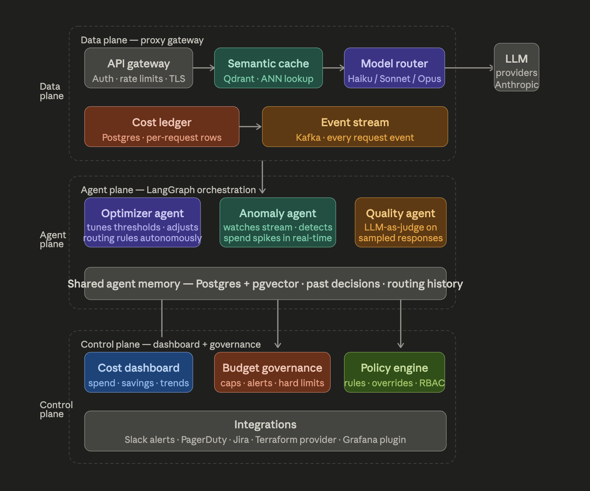
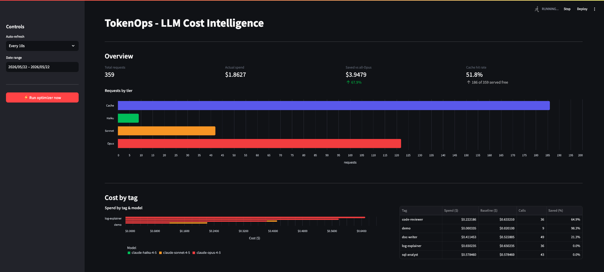
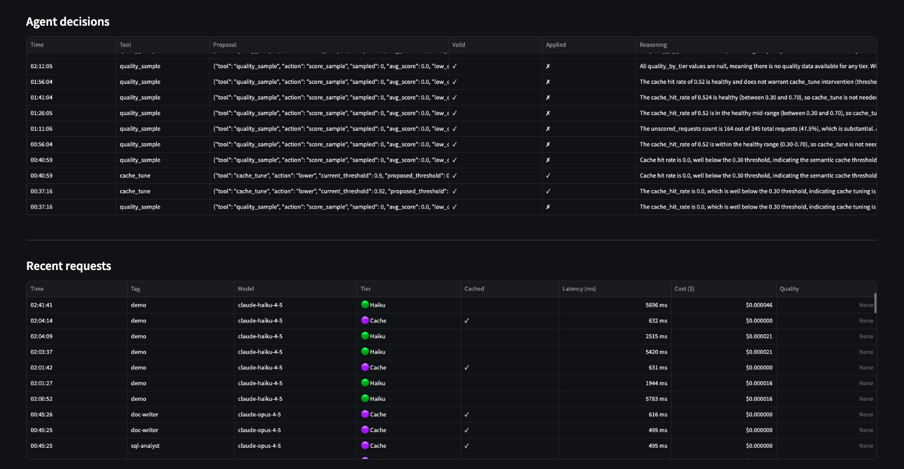

# TokenOps

**Drop-in LLM proxy that caches, routes, tracks, and self-optimizes your AI spend.**

Sits between your app and LLM providers. Zero code changes — just point your base URL at TokenOps.

```
Your app  ──▶  TokenOps (port 8000)  ──▶  Anthropic / OpenAI
                 │
                 ├── semantic cache     52% hit rate · $0.00 per hit
                 ├── smart routing      Haiku / Sonnet / Opus by complexity
                 ├── cost ledger        every cent tracked by team + feature
                 └── optimizer agent    tunes its own rules every 15 min
```

**Demo results (350+ requests):** $1.86 actual vs $3.94 all-Opus baseline → **68% savings**

## Tech stack

FastAPI · LangGraph · Qdrant · PostgreSQL (asyncpg) · Modal (T4 GPU) · Streamlit · LangChain · APScheduler

It combines embeddings, vector databases, LangGraph agents, async Python, and LLMOps into one system.

---

---

## Architecture

Three planes, strictly separated — communicate only through Postgres.

```
┌── DATA PLANE (proxy · port 8000) ─────────────────────────────────┐
│                                                                    │
│  request ──▶ cache.lookup ──▶ HIT? ──yes──▶ return instantly ⚡   │
│                                │                                   │
│                               no                                   │
│                                │                                   │
│              classify (word count + Haiku judge)                    │
│                    │                                               │
│              route (low→Haiku · mid→Sonnet · high→Opus)            │
│                    │                                               │
│              LLM call ──▶ fire-and-forget: cache.store + ledger   │
└────────────────────────────────────────────────────────────────────┘

┌── AGENT PLANE (separate process · every 15 min) ──────────────────┐
│  observe → analyse → validate (back-test 500 reqs) → apply        │
│  writes: routing_rules + agent_decisions                           │
└────────────────────────────────────────────────────────────────────┘

┌── CONTROL PLANE (Streamlit · port 8501) ──────────────────────────┐
│  spend metrics │ cost by tag │ agent decision log │ request feed   │
└────────────────────────────────────────────────────────────────────┘
```



---

## Quick start

```bash
docker-compose up -d                                     # Qdrant + Postgres
docker compose exec -T postgres psql -U tokenops -d tokenops < db/schema.sql
cp .env.example .env                                     # fill in API keys

python3.11 -m venv .venv && source .venv/bin/activate
pip install -r requirements.txt -r requirements-dev.txt

modal setup && modal deploy modal_app/embedder.py        # one-time GPU endpoint
```

Run (four terminals, venv active in each):

```bash
python -m uvicorn proxy.main:app --port 8000 --reload    # proxy
python -m uvicorn host_app.main:app --port 8001 --reload  # demo app
python -m agent.scheduler                                  # optimizer
streamlit run dashboard/app.py                             # dashboard
```

Seed + verify:

```bash
curl http://localhost:8000/health
python -m scripts.seed_demo_traffic                       # 200 requests
# open http://localhost:8501
```

---

## Semantic cache

Not exact match — **meaning match**. Similar questions hit the same cache entry.

```
"Capital of France?"  ──┐
"France's capital?"   ──┼──▶  Modal GPU  ──▶  similar vectors  ──▶  one cache entry
"What is France's     ──┘     bge-small        cosine ≥ 0.86
  capital city?"               384-dim
```

Threshold is **not static** — the optimizer agent tunes it autonomously.
It went 0.92 → 0.86 in the demo run, increasing hit rate from ~10% to 52%.

---

## Optimizer agent

LangGraph state machine. Runs every 15 min in a separate process.

```
observe ──▶ analyse ──▶ validate ──▶ apply
   │           │            │           │
 read DB    pick tools   back-test    write new rules
             │            reject if     to Postgres
             ├── cache_tune       quality drops >5%
             ├── route_optimize
             └── quality_sample
```

Safety bounds are **hard-coded constants** the agent cannot override.
Every decision (accepted or rejected) is logged with reasoning — visible in the dashboard.

---

## Modal endpoint

Embedding model on a T4 GPU — deployed once, scales to zero when idle.

```bash
modal deploy modal_app/embedder.py    # one-time
```

Deploys `BAAI/bge-small-en-v1.5` (384-dim). Proxy calls it with a 4s timeout —
if cold-starting, cache is skipped silently. Re-deploy only when `embedder.py` changes.

---

## Dashboard




| Panel | Shows |
|-------|-------|
| Headline metrics | Spend, savings, cache hit %, tier breakdown |
| Cost by tag | Which feature/team is spending, split by model |
| Agent decision log | Autonomous rule changes with full reasoning |
| Request feed | Last 100 requests — model, cached, latency, cost |

---

## Database

Three tables, defined in `db/schema.sql` only:

| Table | Writer → Reader | Content |
|-------|----------------|---------|
| `routing_rules` | Agent → Proxy (60s reload) | Cache threshold, tier bands |
| `requests` | Proxy → Agent + Dashboard | One row per request, full cost data |
| `agent_decisions` | Agent → Dashboard | Audit trail of every agent decision |

---

## Project structure

```
proxy/          DATA PLANE — every request flows through here
  main.py         request orchestration (cache → classify → route → log)
  cache.py        Qdrant semantic cache
  classifier.py   word count + LLM-as-judge complexity scorer
  router.py       model selection + cost math (pure functions, no I/O)
  ledger.py       async Postgres writes
  config.py       settings + hot-reload from routing_rules

agent/          AGENT PLANE — off the hot path, separate process
  graph.py        LangGraph state machine (observe → analyse → validate → apply)
  tools/          cache_tune · route_optimize · quality_sample

host_app/       DEMO — 4 AI endpoints generating realistic traffic
dashboard/      Streamlit — 4-panel cost dashboard
modal_app/      GPU embedding endpoint (bge-small-en-v1.5)
db/             schema.sql — single source of truth for all tables
```


